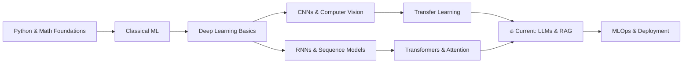

<div align="center">

<!-- Neural Grid Header -->


<br>

<!-- Animated Typing -->


<br><br>

<!-- Profile Views & Followers Badges -->


</div>

<br>

---

## 👾 About Me

<table>
<tr>
<td width="55%">

### `$ whoami`

```python
class NoorUlAmin:
    name       = "Noor Ul Amin"
    degree     = "BS Artificial Intelligence"
    semester   = "6th Semester"
    location   = "Pakistan 🇵🇰"

    interests  = [
        "Machine Learning",
        "Deep Learning",
        "Neural Networks",
        "Computer Vision",
        "Natural Language Processing",
        "Data Science",
    ]

    class Profile:
        def __init__(self):
            self.focus_areas = [
                "Deep Learning Architecture Design",
                "Computer Vision (CNNs & Transfer Learning)",
                "NLP (RNNs, Transformers, Attention)",
                "Information Retrieval & Search Systems",
                "Model Optimization & Hyperparameter Tuning",
            ]
            self.currently   = "Architecting Neural Nets & Fine-Tuning Models"
            self.learning    = "LLMs, RAG Systems, and MLOps Pipelines"
            self.open_to     = "Collaborations & High-Impact AI Projects"
            self.motto       = "Model. Train. Deploy. Repeat."

    def greet(self):
        return "Let's build something extraordinary with AI 🚀"
```

</td>
<td width="45%" align="center">


<br>


</td>
</tr>
</table>

---

## 🧠 Core Competencies

<div align="center">

| Domain | Technologies & Skills |
|:------:|:----------------------|
| **Languages** | Python · SQL · Markdown · Bash |
| **ML / DL Frameworks** | TensorFlow · PyTorch · Scikit-Learn · Keras · HuggingFace |
| **Data Engineering** | NumPy · Pandas · Matplotlib · Seaborn · Plotly |
| **Deep Learning Concepts** | CNNs · RNNs · LSTMs · GRUs · Transformers · Attention Mechanisms |
| **NLP & IR** | Tokenization · TF-IDF · Inverted Index · Word Embeddings · BERT |
| **Computer Vision** | Image Classification · Transfer Learning · Object Detection |
| **Tools & Platforms** | JupyterLab · Git · GitHub · VS Code · Google Colab · Docker |
| **Mathematics** | Linear Algebra · Calculus · Probability · Statistics · Optimization |

</div>

---

## 🛠️ Tech Stack

<div align="center">

### Languages


### ML / DL Frameworks


### Data & Visualization


### Tools & Environment


</div>

---

## 🚀 Current Focus

<div align="center">

```
┌─────────────────────────────────────────────────────────────────┐
│                    🔬 ACTIVE LEARNING AREAS                     │
├─────────────────────────┬───────────────────────────────────────┤
│  Large Language Models  │  RAG Pipelines & Vector Databases      │
│  MLOps & Deployment     │  Fine-Tuning Pre-trained Models        │
│  Attention Mechanisms   │  Efficient Neural Architecture Design   │
│  Information Retrieval  │  Evaluation Metrics & Benchmarking     │
└─────────────────────────┴───────────────────────────────────────┘
```

</div>

---

## 📈 Learning Roadmap



---

## 📊 GitHub Analytics

<div align="center">


</div>

---

## 📡 Contribution Activity

<div align="center">

</div>

---

## 🏆 GitHub Trophies

<div align="center">

</div>

---

## 💡 Fun Facts About Me

```python
fun_facts = {
    "☕ fuel"         : "Coffee + curiosity = late-night model training",
    "🧩 approach"     : "I debug neural nets like solving puzzles",
    "📚 reading"      : "Research papers > social media (most days)",
    "🎯 goal"         : "Build AI that makes a real-world difference",
    "🌙 peak hours"   : "Most productive between 11 PM and 3 AM",
    "🤖 philosophy"   : "Every line of code is a step toward better AI",
}

for fact, detail in fun_facts.items():
    print(f"  {fact}  →  {detail}")
```

---

## 🤝 Connect With Me

<div align="center">

[](https://www.linkedin.com/in/noor-ul-amin-0b8560285/)
[](https://instagram.com/nur_ul_amyn)
[](https://github.com/nur-ul-amin)

<br>

💬 **Got an AI project idea? Want to collaborate? Feel free to reach out!**

</div>

---

<div align="center">

<br>

> *"In a world of noise, let your models speak with precision."*

<br>


<br>


</div>
