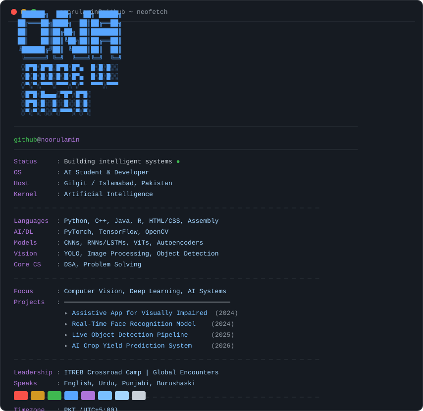

<a href="https://github.com/nur-ul-amin">
  <picture>
    <source media="(prefers-color-scheme: dark)" srcset="dark_mode.svg">
    <source media="(prefers-color-scheme: light)" srcset="light_mode.svg">
    
  </picture>
</a>

 

  &nbsp;
  &nbsp;
  

  

---

<b>📊 GitHub Stats</b>

 

  
  

  

<b>🏗️ Featured Projects</b>

 

  
  

  
  

<b>🛠️ Tech Stack</b>

 

  
  
  
  
  
  

  
  
  
  

---

  

