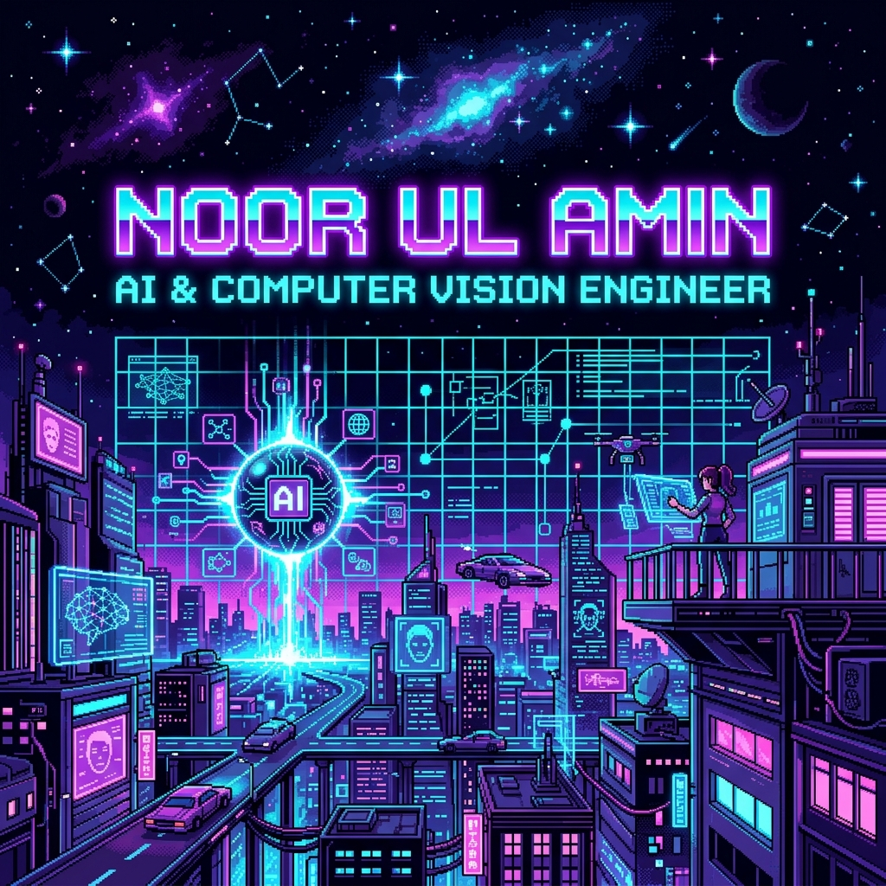
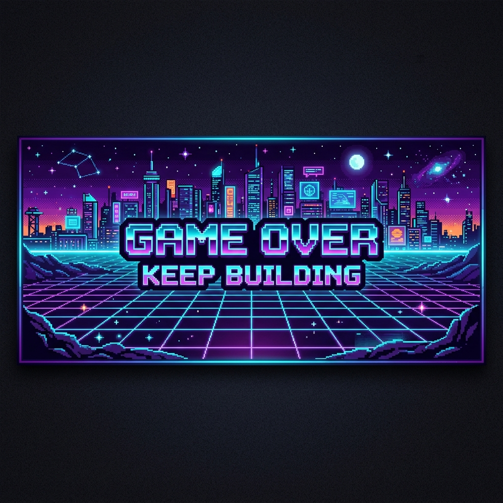

<div align="center">

  <!-- Pixel Art Header Banner -->
  

  <br/><br/>

  <!-- Retro Typing SVG -->
  <br/><br/>

  <!-- Arcade Badges -->
  <a href="https://www.linkedin.com/in/noor-ul-amin-0b8560285/">
    
  </a>
  &nbsp;
  <a href="mailto:aminnulnoor10@gmail.com">
    
  </a>
  &nbsp;
  <a href="https://twitter.com/NoorUlA67762535">
    
  </a>
  &nbsp;
  <a href="https://instagram.com/nur_ul_amyn">
    
  </a>

  <br/><br/>

  <!-- Profile Visitor Counter -->
  

</div>

<br/>

---

### 🎮 PLAYER CHARACTER STATS

```yaml
[CHARACTER SHEET]
NAME        : NOOR UL AMIN
CLASS       : AI & COMPUTER VISION ENGINEER
LEVEL       : 99
SPAWN POINT : GILGIT / ISLAMABAD, PAKISTAN 🇵🇰
PRIMARY     : PYTHON, PYTORCH, OPENCV, C++
SPECIALTY   : REAL-TIME VISION & PHYSICS SIMULATION
```

- 🕹️ **Class**: Artificial Intelligence & Computer Vision Developer
- ⚔️ **Main Weapon**: Python & PyTorch Deep Learning Frameworks
- 🛡️ **Armor**: OpenCV, YOLO & Convolutional Neural Networks
- 📜 **Active Quest**: Multi-Object Tracking (MOT), Real-Time Detection & Physics Engines
- 🧠 **Exploring**: Transformer Architectures, Vision-Language Models (VLMs) & MLOps
- 💬 **Ask Me About**: Computer Vision, PyTorch, Neural Nets, OpenCV & C++

---

### 👾 TECH STACK & ARSENAL

<p align="center">
  <b>🕹️ PROGRAMMING CORE</b><br/>
  
  
  
  
  
</p>

<p align="center">
  <b>🧠 COMPUTER VISION & AI</b><br/>
  
  
  
  
  
  
</p>

<p align="center">
  <b>🛠️ DEVELOPER GEAR</b><br/>
  
  
  
  
</p>

---

### 🕹️ FEATURED QUESTS & PROJECTS

<table>
  <tr>
    <td width="50%" valign="top">
      <h3 align="center">🎯 Motion Tracker</h3>
      <p>Real-time computer vision motion tracking pipeline using OpenCV for high-precision video analysis and multi-object tracking.</p>
      <p align="center">
        <a href="https://github.com/nur-ul-amin/Motion-Tracker">
          
        </a>
      </p>
    </td>
    <td width="50%" valign="top">
      <h3 align="center">⏳ Custom Pendulum Simulator</h3>
      <p>Interactive multi-pendulum chaos simulator featuring custom RK4 physics integration, infinite canvas, and interactive builder mode.</p>
      <p align="center">
        <a href="https://github.com/nur-ul-amin/PendulumSim">
          
        </a>
      </p>
    </td>
  </tr>
  <tr>
    <td width="50%" valign="top">
      <h3 align="center">🚗 Driver Fatigue Detection</h3>
      <p>Computer vision system monitoring facial landmarks and eye aspect ratio (EAR) to detect real-time driver alertness and safety.</p>
      <p align="center">
        <a href="https://github.com/nur-ul-amin/driver_fatigue_detection">
          
        </a>
      </p>
    </td>
    <td width="50%" valign="top">
      <h3 align="center">🔬 OpenCV Edge Detection</h3>
      <p>Optimized image processing framework implementing adaptive filters, edge detection pipelines, and custom vision algorithms.</p>
      <p align="center">
        <a href="https://github.com/nur-ul-amin/opencv-edge-detection">
          
        </a>
      </p>
    </td>
  </tr>
</table>

---

### 📊 SYNTHWAVE ANALYTICS

<div align="center">
  
  &nbsp;
  
</div>

<br/>

<div align="center">
  
</div>

<br/>

---

<div align="center">

  <!-- Pixel Art Footer Banner -->
  

</div>
